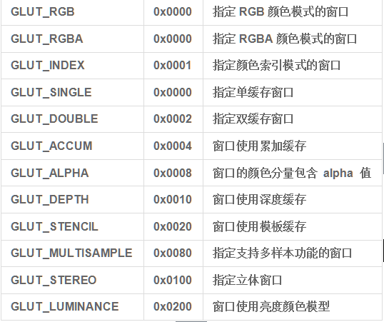

# pyopengl-零基础入门
## 目录
### [创建一个窗体](./window.py)
显示一个最基本的窗体，并对其大小、位置、显示模式进行设置。

常见的窗体模式如下图

设置窗体大小和位置的两个函数参数都是横轴、纵轴像素大小，其中位置是相对于屏幕左上角。
```python
glutInitWindowSize(600, 250)  # 
glutInitWindowPosition(200, 400)    # 
```
### [点线面]](./plp.py)


## 致谢
对以下内容的作者表示感谢
- [写给 python 程序员的 OpenGL 教程](https://xufive.blog.csdn.net/article/details/86565130)
- [一篇就够的超良心pyOpenGL入门教程，不香喷我！](https://blog.csdn.net/edj_13/article/details/104673528)
- [Basic OpenGL](http://www.opengl-tutorial.org/beginners-tutorials/)
- [OpenGL学习进程（3）第一课：初始化窗体](https://www.cnblogs.com/MenAngel/p/5619808.html)
- []()
