# pyopengl-零基础入门
## 目录
### [创建一个窗体](./window.py)
显示一个最基本的窗体，并对其大小、位置、显示模式进行设置。

常见的窗体模式如下图  

- GLUT_SINGLE   :   单缓冲区窗口,当不需要用户交互时用单缓冲，配套glFlush()。需要用户交互时要用双缓冲。
- GLUT_DOUBLE   :   双缓冲区窗口,这是产生流畅动画必须选的，配套glutSwapBuffers()。

设置窗体大小和位置的两个函数参数都是横轴、纵轴像素大小，其中位置是相对于屏幕左上角。
```python
glutInitWindowSize(600, 250)  # 
glutInitWindowPosition(200, 400)    # 
```
### [点线面](./plp.py)
在[用PyOpenGL叩开3D的心扉——OpenGL全解析4](https://eyehere.net/2011/learn-opengl-3d-by-pyopengl-4/)一文中。作者给出了10中基本图形的绘制函数列表及其对应的结果，这里对部分函数做一些举例。
#### 运行流程
里面用print大法对程序运行结构做了一个探究，程序在注册回调函数时并没有调用它，而是在进入glutMainLoop()之后才调用了回调函数，至于glutMainLoop()之后的3根本没有出现，也就是说程序一直在进行Loop。
#### 颜色
如果不指定颜色，OpenGL默认前景色为白色，背景色为黑色。颜色有两类好几种实现方法，RGB（红绿蓝）或者RGBA（多一个不透明度）
glColor打头，3、4表示参数个数，f代表[0,1]区间的浮点数，ub表示[0,255]之间的无符号整形吧？？更多详见[openGL 函数-glVertex* 指定顶点的值](https://blog.csdn.net/qq844352155/article/details/28465919)
```python
glColor4f(0.0, 1.0, 0.0, 1.0)  # 设置画笔颜色为绿色，不透明度为1
glColor3f(0.0, 1.0, 0.0)
glColor3ub(0, 255, 0)
glColor3fv([0.0, 1.0, 0.0])
```
颜色填充与否取决于设置，默认为颜色填充，可设置为不填充，此设置会保留
```python
glPolygonMode(GL_FRONT, GL_LINE)  # 设置不填充模式
glPolygonMode(GL_BACK, GL_FILL)
```
如果之前设置了不填充画了一个球，现在想画一个填充的爱心，那就的重新设置为填充模式了
```python
glPolygonMode(GL_FRONT, GL_FILL)  # 设置填充
glPolygonMode(GL_BACK, GL_LINE)
```
#### 点的坐标
`glVertex2f(-1.0, -1.0)`表示给出的点的坐标为(-1.0, -1.0)-窗体左下角，右上角为(1.0, 1.0)
`glVertex3f(-1.0, -1.0, 0.0)`表示点的坐标为(x,y,z)类型，z=0.0时和上面表示一样  
绘制图形时并不直接给出一串点的坐标，而是通过一个个顶点的方式在glBegain()、glEnd()之间给出，需要注意的是，绘制多边形时是由顶点之间的线段连接起来的，这些线段不能交叉。
```python
# 如果把plp.py中的drawquad函数换位以下内容，观察所绘制出的四边形
def drawquad():
    """绘制四边形"""
    glBegin(GL_QUADS)
    glColor3f(0, 1, 1)  
    glVertex2f(0.5, 0.0)
    glVertex2f(0.5, -0.8)
    glVertex2f(1.0, 0.0)    # 点的顺序发生了变化
    glVertex2f(1.0, -0.8)
    glEnd()
```
### [键鼠事件](./event.py)
对对应的事件进行回调函数注册，在回调函数中对全局变量做更新并处理。有鼠标点击（含按下和释放）、拖动、移动、键盘、窗体大小修改事件。窗体拖动咋整哦-.-
### [绘制字符串](./word.py)
使用PyOpenGL绘制非中文字符串
### [视见区域/视口](./glViewport.py)
参见[OpenGL的glViewport()函数和glOrtho()函数用法](https://blog.csdn.net/sj19890401/article/details/19976667)，默认情况下视口大小和窗口大小一样，如果想在一个窗口显示多个视图，可以设置多个视口来分割窗口    
### [视景体](./gluOrtho2D.py)
[glOrtho(left, right, bottom, top, zNear, zFar)](./glOrtho.py)、[gluOrtho2D(left, right, bottom, top)]((./gluOrtho2D.py))用来创建一个正交的视景体（View Volume），说人话就是用一个长方体（形）内部区域表示我们能看到的区域，如果要表示的物体大小不变，随着这个视景体区域越大，看到的物体就会越小。

  
设置视景体之后再次设置视景体会在当前的基础上进行设置，而不是从全局大小上设置，比如先看全局1/4的区域，然后再看1/8的区域，此时看到的全局的1/32，如果想看到全局的1/8，就需要在设置视景体之前重置观察矩阵`glLoadIdentity()`。  
### [立方体](./cube.py)
在二维平面上显示三维物体-.-计算机图形学>透视、投影、变换、消隐等。  
以在屏幕上显示一个正方体为例子，学过立体几何的都知道三维坐标系中可以明确一个正方体八个顶点的坐标，但是屏幕是二维的啊，要将三维物体显示到二维？？？二向箔降维打击咩？其实不是的，从我们人眼的角度来说，现实生活中的物体都是三维图形吧，但是光线最后汇聚在眼球里的视网膜的时候就都变成了二维了，这中间就会涉及到透视、投影面、消隐等，当然用OpenGL必然不会自己去写啥变换矩阵，那必须OpenGL自己算呗。这是一个[图形学的案例](https://gitee.com/anidea/ComputerGraphics)，里面有如何从三维坐标变成二维坐标的pygame实现（plt、eaxys同理）。  
现在，假设已经确定这里有一个立方体的八个空间坐标(x,y,z)，由于我们稍微移动下自己的位置，看到的正方体就“不一样”，因此需要确定我们眼睛的方位：包含眼睛的位置、朝哪看、正着看还是倒着看。如果这些参数都确定了，那么我们就能通过知识的力量算出来我们看到的正方体究竟长什么模样。  
#### 懒人生成立方体
自己画立方体的画要确定八个点六个面，偷懒调库好了，下面两个函数用来生成中心位于原点，边长为size的立方体  
`glutWireCube(size)`生成立方体的边框  
`glutSolidCube(size)`生成实心立方体  
#### 视点/视角
`gluLookAt( GLdouble(eyeX), GLdouble(eyeY), GLdouble(eyeZ), GLdouble(centerX), GLdouble(centerY), GLdouble(centerZ), GLdouble(upX), GLdouble(upY), GLdouble(upZ) )`  
前三个参数设置了眼睛（摄像机、脑袋）的世界坐标位置  
中间三个参数设置了眼睛朝着哪个点看  
最后三个设置脑袋是正着看还是倒着看（头朝天还是头朝地），一般设置为y轴正方向(0,1,0)    
在默认情况下，照相机位于原点，指向z轴的负方向，朝上向量为(0,1,0)  
##### [glMatrixMode](https://baike.baidu.com/item/glMatrixMode)
OpenGL里有如下几种矩阵：  
###### GL_MODELVIEW
模型观察矩阵，表示物体的位置变化和观察点的改变；
###### GL_PROJECTION
投影矩阵，描述如何将一个物体投影到平面上；通常会配合[glFrustum(left,right,bottom,top,zNear,zFar)](https://baike.baidu.com/item/glFrustum)、[gluPerspective(GLdouble fovy, GLdouble aspect, GLdouble zNear, GLdouble zFar)](https://blog.csdn.net/tyxkzzf/article/details/40921713)设置一个棱台一样的视景体区域
###### GL_TEXTURE
纹理矩阵，描述纹理坐标的动态变化
#### demo
[基础立方体](./cube0.py)：绘制一个立方体，设置透视投影  
[带消隐立方体](./cube1.py)：彩色立方体加上遮挡关系（用Zbuffer深度来实现消隐），单击鼠标切换视角  
[带消隐立方体2](./cube.py)：单击鼠标左键旋转立方体  
## flake8 F403 F405
代码中如果使用flake8检查，会提示大量的F403+F405错误，我是用的是VS Code，在.vscode/setting.json中加入一些设置便可以不提示这两个烦人的红叉叉
```
"python.linting.flake8Args": [
    "--extend-ignore = F403,F405"
]
```
## 致谢
对以下内容的作者表示感谢
- [写给 python 程序员的 OpenGL 教程](https://xufive.blog.csdn.net/article/details/86565130)
- [一篇就够的超良心pyOpenGL入门教程，不香喷我！](https://blog.csdn.net/edj_13/article/details/104673528)
- [OpenGL学习进程（3）第一课：初始化窗体](https://www.cnblogs.com/MenAngel/p/5619808.html)
- [openGL 函数-glVertex* 指定顶点的值](https://blog.csdn.net/qq844352155/article/details/28465919)
- [Python中的除法](https://blog.csdn.net/sicofield/article/details/8613877)
- [Python 入门基础知识 - 多媒体编程 - 使用PyOpenGL绘制3D图形](https://www.walkerfree.com/search/?key=opengl&submit=Search)
- [用PyOpenGL叩开3D的心扉——OpenGL全解析](https://eyehere.net/category/python/)
- [一步步学OpenGL3.3+  - Mr_厚厚](https://blog.csdn.net/cordova/category_9266966.html)
- [OpenGL的glViewport()函数和glOrtho()函数用法](https://blog.csdn.net/sj19890401/article/details/19976667)
- [OpenGL学习(三)三维编程基础](https://blog.51cto.com/6996127/1546600)
- [Opengl---gluLookAt函数详解](https://blog.csdn.net/ivan_ljf/article/details/8764737)
- [OpenGl的glMatrixMode()函数理解](https://blog.csdn.net/jiangdf/article/details/8460012)
- [Python之OpenGL笔记](https://blog.csdn.net/dalong10/category_7610839.html)
- []()
- []()
- []()
